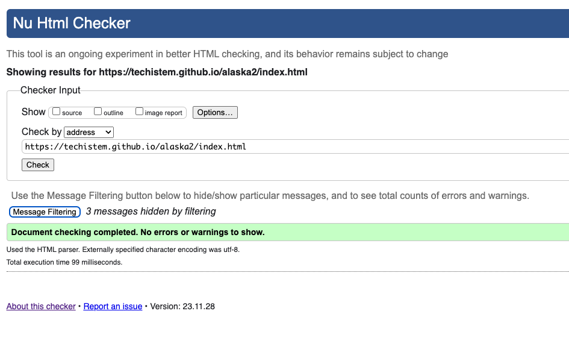
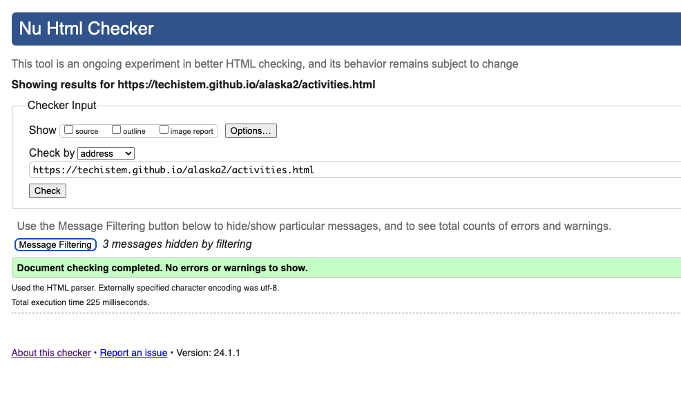
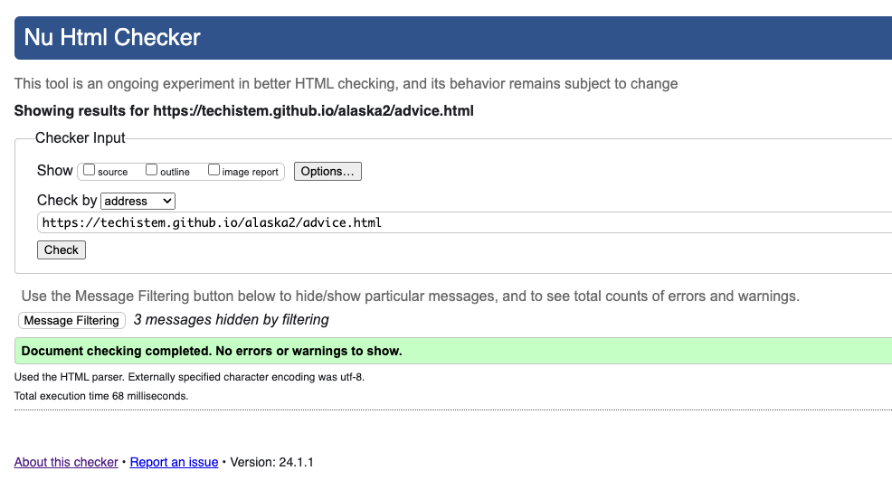
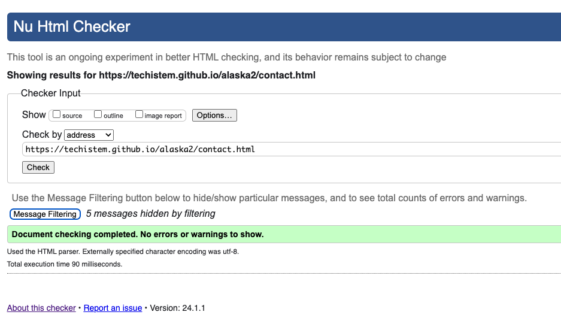
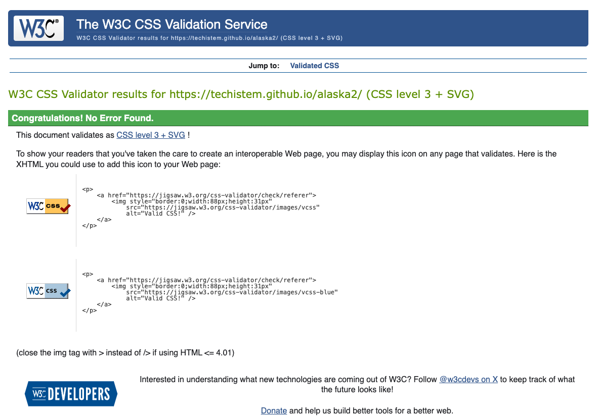
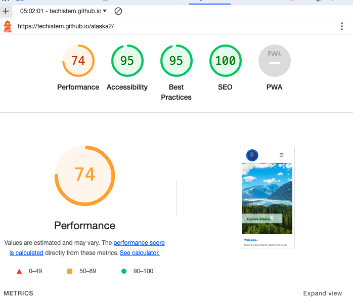
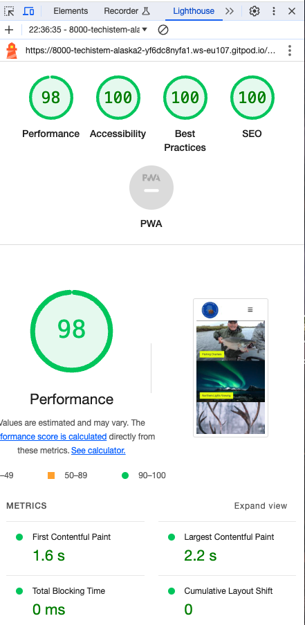
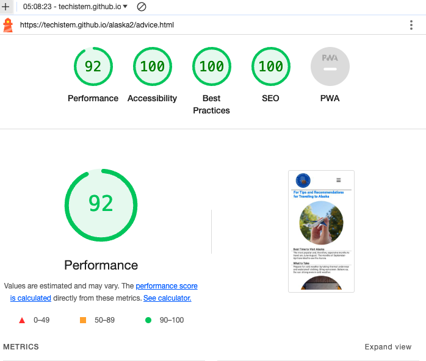
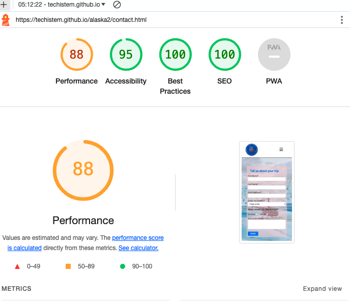

# TESTING

## Validator testing
+ ### HTML
  #### Home Page
    - No errors or warnings were found when passing through the official W3C validator.

    
    
  #### Activities Page
    - No errors or warnings were found when passing through the official W3C validator.

    

  #### Advice Page
    - No errors or warnings were found when passing through the official W3C validator.

    

  #### Contact Us Page
    - No errors or warnings were found when passing through the official W3C validator.

    

  ### CSS
  No errors or warnings were found when passing through the official W3C (Jigsaw) validator.
  
  

## LightHouse report

    - Using lighthouse in devtools I confirmed that the website is performing well, accessible and colors and fonts chosen are readable.
    
  ### Home page

  

  ### Activities page

  

  ### Advise page

  

  ### Contact Us page

  

---

## Bugs
+ ### Solved bugs
    1. When I added text to the photos in the Activities section, the photos moved up.
    
        *Solutions:* #photos img values should be examined
    
    2. The gallery image descriptions were not appearing on the picture when hovering it as the position of the .image_content was set to fixed.
        
        *Solution:* The .image_content position was set to absolute, with the top: 0, left: 0, and added padding on the .image_content. 

    3. Although the map looked good on the page when width = 100%, it gave errors on different screens.
        
        *Solution:* width="300" set

    4. When the px of the logo was large, it covered the entire Home page.
        
        *Solution:* Extra px dimensions have been changed

    ---
+ ### Unsolved bugs
    - None.
+ ### Mistakes
    - I write commitments very briefly. As I progressed in the program, I started writing detailed commits. 
    - I was making a lot of spelling mistakes. I reduced my mistakes using Emmet
---